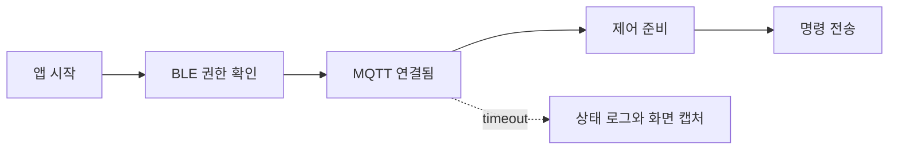

Flutter integration_test가 로컬에서는 통과하고 CI나 Firebase Test Lab에서만 실패한다면 `pumpAndSettle()`을 더 넣거나 `Future.delayed()` 시간을 늘리는 것으로는 오래 못 버틴다. IoT 앱에서는 BLE 연결, MQTT 구독, 화면 상태 반영이 서로 다른 시계로 움직인다. 고정 시간 대신 “어떤 상태가 될 때까지” 기다리도록 바꿔야 flaky 테스트가 줄어든다.

## 2초를 기다리면 된다고 생각했다

처음 보일러 제어 테스트는 로그인 후 2초를 기다리고 버튼을 눌렀다.

```dart
await tester.pump(const Duration(seconds: 2));
await tester.tap(find.text('가동'));
```

개발 맥에서는 잘 됐다. 그런데 Test Lab의 느린 기기에서는 MQTT 구독이 아직 끝나지 않아 버튼은 보여도 명령 전송 준비가 안 된 상태였다. 빠른 기기에서는 2초가 낭비였고, 느린 기기에서는 부족했다. 실패 메시지는 둘 다 `TimeoutException`이라 원인을 바로 알기도 어려웠다.

| 대기 방식 | 빠른 기기 | 느린 기기 | 판단 기준 |
|---|---:|---:|---|
| 고정 `delay` | 불필요하게 느림 | 여전히 실패 | 시간 |
| `pumpAndSettle`만 사용 | 애니메이션에서 멈춤 | 네트워크 상태는 모름 | 프레임 큐 |
| 상태 대기 헬퍼 | 빠르게 통과 | 제한 시간 안에서 명확히 실패 | 앱 상태 |

## 상태를 기다리는 헬퍼를 만든다

테스트가 네트워크 구현을 직접 알지 않도록, 화면에 표시되는 연결 상태를 기준으로 기다렸다. `pumpAndSettle()`은 위젯 프레임이 안정된 것만 보장할 뿐 MQTT가 연결됐다는 뜻은 아니다.

```dart
Future<void> waitForText(
  WidgetTester tester,
  String text, {
  Duration timeout = const Duration(seconds: 15),
}) async {
  final end = DateTime.now().add(timeout);

  while (DateTime.now().isBefore(end)) {
    if (find.text(text).evaluate().isNotEmpty) return;
    await tester.pump(const Duration(milliseconds: 100));
  }

  throw TestFailure('상태 대기 시간 초과: $text');
}

testWidgets('MQTT 연결 후 보일러를 가동한다', (tester) async {
  await tester.pumpWidget(const TestApp());

  await waitForText(tester, 'MQTT 연결됨');
  await waitForText(tester, '보일러 제어 준비');
  await tester.tap(find.text('가동'));
  await waitForText(tester, '가동 명령 전송 완료');
});
```

실제 앱에서는 문자열보다 `ConnectionState.connected` 같은 상태 키가 더 안전하다. 화면에 상태가 없다면 테스트 전용 `TestTrace`나 Fake Repository 이벤트를 활용하면 된다. 핵심은 “2초가 지났는가”가 아니라 “명령을 보낼 조건이 갖춰졌는가”를 확인하는 것이다.

## 실패할 때 원인을 남긴다

상태 대기에는 반드시 단계 이름과 현재 상태를 붙였다. BLE 권한 다이얼로그가 남아 있는지, MQTT가 재연결 중인지가 없으면 같은 flaky 실패를 여러 번 재실행하게 된다.

```dart
Future<void> waitForReady(WidgetTester tester) async {
  final started = DateTime.now();
  debugPrint('[iot-test] ready 대기 시작');

  try {
    await waitForText(tester, '보일러 제어 준비');
  } finally {
    debugPrint('[iot-test] ready 대기 종료: '
        '${DateTime.now().difference(started).inMilliseconds}ms');
  }
}
```

CI에서는 각 테스트를 무조건 재시도하지 않았다. 재시도는 원인을 숨기고 실행 시간만 늘린다. 단계별 로그, 실패 화면, MQTT Fake의 마지막 이벤트를 아티팩트로 남겼다. 같은 단계에서 반복 실패하면 초기화 누락이나 실제 상태 전이 버그일 가능성도 확인해야 한다.



그림에서 봐야 할 부분은 각 단계가 순서대로 완료된 뒤에만 명령을 보내야 한다는 점이다. `pump` 호출 횟수나 임의의 sleep 시간은 이 흐름을 보장하지 않는다.

## 주의할 점

테스트 제한 시간을 너무 길게 잡으면 CI가 멈춘 것처럼 보인다. BLE 권한, MQTT 연결, 화면 준비를 하나의 60초 대기로 묶지 말고 단계마다 5~15초로 나눠야 느린 구간이 드러난다. Fake 서비스도 실제 서비스와 같은 상태 전이를 흉내 내야 한다. 처음부터 `connected`를 반환하면 재연결 중 UI를 검증할 수 없다.

짧게 정리하면, Flutter integration_test의 flaky 문제는 기다리는 시간을 늘리는 문제가 아니라 기다림의 기준을 바꾸는 문제였다. IoT 앱에서는 BLE·MQTT·UI 상태를 분리하고, 각 경계에 제한 시간과 진단 자료를 두는 편이 Firebase Test Lab에서도 재현 가능한 테스트에 가깝다.
