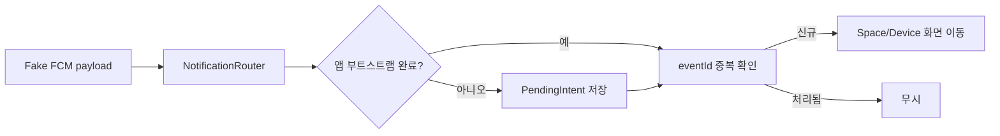

이 그림에서 볼 부분은 알림을 보냈다는 사실보다, 사용자가 알림을 탭한 뒤 **정확한 공간과 기기 화면에 한 번만 도착하는지**다.

Flutter integration_test로 스마트홈 앱을 검사하면서 FCM 알림 자체는 Fake로 바꿨는데, 알림을 탭한 뒤 화면이 가끔 두 번 열렸다. 앱이 종료된 상태에서 시작하면 더 심했다. 처음엔 Navigator 문제라고 생각했지만 원인은 `getInitialMessage()`와 `onMessageOpenedApp`이 같은 payload를 각각 전달하는 초기화 순서였다.

## 알림 진입은 세 가지 상태를 나눠야 한다

IoT 알림은 단순한 `route` 문자열보다 `spaceId`, `deviceId`, `eventId`를 함께 갖는다. 보일러가 여러 공간에 등록될 수 있어서 기기 ID만으로 화면을 찾으면 다른 집의 기기 화면이 열릴 수 있다.

| 앱 상태 | Firebase 이벤트 | 테스트에서 확인할 것 |
|---|---|---|
| 실행 중 | `onMessage` | 알림 배너만 표시하고 자동 이동하지 않음 |
| 백그라운드 | `onMessageOpenedApp` | 탭 한 번에 제어 화면으로 이동 |
| 종료 상태 | `getInitialMessage()` | 부트스트랩 완료 뒤 한 번만 라우팅 |

흐름은 아래처럼 짧게 고정했다.



## 실제 Firebase 대신 알림 라우터를 주입한다

테스트가 FCM 서버와 OS 알림 트레이를 기다리지 않도록, 앱이 받는 입력만 같은 형태로 전달하는 Fake를 만들었다. `eventId`를 라우터 내부에서 기억하는 것이 중복 탭 방지의 핵심이다.

```dart
class FakeNotificationSource implements NotificationSource {
  final _opened = StreamController<NotificationPayload>.broadcast();
  NotificationPayload? initialMessage;

  @override
  Stream<NotificationPayload> get opened => _opened.stream;

  @override
  Future<NotificationPayload?> getInitialMessage() async => initialMessage;

  void tap(NotificationPayload payload) => _opened.add(payload);

  Future<void> dispose() => _opened.close();
}

class NotificationRouter {
  NotificationRouter(this.source, this.go);

  final NotificationSource source;
  final void Function(String spaceId, String deviceId) go;
  final _handled = <String>{};
  bool ready = false;
  NotificationPayload? pending;

  Future<void> start() async {
    source.opened.listen(_accept);
    final initial = await source.getInitialMessage();
    if (initial != null) _accept(initial);
  }

  void setReady() {
    ready = true;
    final value = pending;
    pending = null;
    if (value != null) _accept(value);
  }

  void _accept(NotificationPayload value) {
    if (!ready) {
      pending = value;
      return;
    }
    if (!_handled.add(value.eventId)) return;
    go(value.spaceId, value.deviceId);
  }
}
```

코드에서 `pending`을 하나만 두는 이유는 최신 알림 하나만 처리하기 위해서다. 종료 상태에서 부트스트랩 전에 알림이 여러 개 쌓였다고 전부 순서대로 열면, 사용자는 첫 화면으로 이동하자마자 두 번째 화면으로 끌려간다. 알림 목록은 별도 기능으로 처리하고, 딥링크는 현재 유효한 하나만 소비하는 편이 예측 가능했다.

## integration_test에서 종료 상태와 중복 탭을 재현한다

테스트 앱을 만들 때 실제 Firebase 초기화 대신 Fake source와 테스트용 Router를 주입한다. 여기서 `setReady()` 호출 위치가 중요하다. `runApp()` 직후가 아니라 인증과 공간 목록을 읽은 뒤에 호출해야 `spaceId`를 검증할 수 있다.

```dart
testWidgets('종료 상태 알림은 준비 후 한 번만 기기 화면을 연다', (tester) async {
  final source = FakeNotificationSource()
    ..initialMessage = NotificationPayload(
      eventId: 'evt-42', spaceId: 'home-1', deviceId: 'boiler-7');
  final routes = <String>[];
  final router = NotificationRouter(source, (spaceId, deviceId) {
    routes.add('$spaceId/$deviceId');
  });

  await router.start();
  expect(routes, isEmpty); // 앱 준비 전에는 이동하지 않음

  router.setReady();
  expect(routes, ['home-1/boiler-7']);

  source.tap(source.initialMessage!); // 같은 알림을 두 번 탭한 상황
  await tester.pump();
  expect(routes, ['home-1/boiler-7']);

  await source.dispose();
});
```

처음 테스트에서는 `router.start()` 뒤에 바로 `expect(routes, ...)`를 썼다가 간헐적으로 실패했다. `getInitialMessage()`가 `Future`라서가 아니라, Stream listener와 초기 메시지 처리가 서로 다른 순서로 끝날 수 있었기 때문이다. 화면의 `pumpAndSettle()`만 늘리는 대신 라우터의 준비 상태와 최종 이동 목록을 직접 검사하니 원인이 드러났다.

## 실제 FCM 테스트와 Fake 테스트의 경계

모든 것을 Fake로 대체하면 Firebase SDK 설정 오류는 잡히지 않는다. 반대로 모든 테스트를 실제 FCM으로 돌리면 토큰 발급, 네트워크, 알림 권한 때문에 integration_test가 느리고 불안정해진다.

| 검증 대상 | 권장 방식 |
|---|---|
| payload의 공간·기기 매핑 | Fake source + integration_test |
| 종료/백그라운드 라우팅 | Fake source로 상태 재현 |
| Android 알림 권한과 OS 탭 | Patrol 실기기 테스트 |
| FCM 서버 전달과 토큰 | 소수의 별도 스모크 테스트 |

정리하면 Flutter integration_test의 푸시 알림 테스트는 FCM을 빨리 연결하는 문제가 아니다. `eventId` 중복 방지, 앱 준비 전 pending 처리, `spaceId` 검증을 앱 코드의 명시적인 경계로 만들고 그 경계를 Fake 입력으로 반복 검증하는 문제다. 실제 OS 알림 트레이까지 확인해야 하는 케이스만 Patrol로 분리하면 CI에서 실패 원인도 훨씬 선명해진다.
