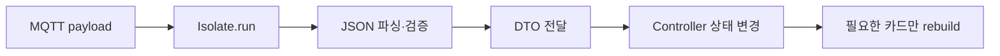

Flutter IoT 앱에서 MQTT 메시지를 받는다고 해서 네트워크만 비동기인 것은 아니다. 큰 센서 이력 JSON을 `jsonDecode()`로 메인 isolate에서 처리하면 화면 터치와 애니메이션이 잠깐 멈춘다. 이번에는 MQTT 연결은 그대로 두고, CPU를 쓰는 파싱만 `Isolate.run()`으로 분리했다.

## 처음에는 MQTT가 느린 줄 알았다

스마트홈 대시보드에 기기 20개의 이력 데이터를 한 번에 내려보내는 테스트를 했다. 수신 로그의 간격은 정상인데, 메시지를 받은 직후 200~300ms 정도 화면이 굳었다. DevTools Timeline을 보니 원인은 MQTT client가 아니라 메인 isolate의 JSON 파싱이었다.

| 작업 | 실행 위치 | 판단 |
| --- | --- | --- |
| MQTT 소켓 수신 | 네트워크 이벤트 | 그대로 유지 |
| JSON 문자열 파싱 | 메인 isolate | 큰 payload면 분리 |
| 화면 상태 변경 | 메인 isolate | 파싱 결과만 전달 |
| Realm 객체 접근 | 해당 isolate 규칙 준수 | 객체를 그대로 전달하지 않음 |

핵심 흐름은 아래처럼 단순하다.



## 파싱 함수는 isolate 밖의 상태를 읽지 않는다

`Isolate.run()`에 넘기는 함수는 전역 Repository나 GetX Controller를 참조하지 않고, 문자열을 받아 결과를 반환하도록 만들었다. 그래야 테스트가 쉬워지고 isolate 사이에서 보낼 수 없는 객체도 피할 수 있다.

```dart
import 'dart:convert';
import 'dart:isolate';

class DeviceSnapshot {
  const DeviceSnapshot(this.deviceId, this.temperature);

  final String deviceId;
  final double temperature;
}

List<DeviceSnapshot> parseSnapshots(String raw) {
  final decoded = jsonDecode(raw) as List<dynamic>;
  return decoded.map((item) {
    final json = item as Map<String, dynamic>;
    return DeviceSnapshot(
      json['deviceId'] as String,
      (json['temperature'] as num).toDouble(),
    );
  }).toList(growable: false);
}

Future<List<DeviceSnapshot>> decodeMqttPayload(String payload) {
  return Isolate.run(() => parseSnapshots(payload));
}
```

MQTT 콜백에서는 결과를 받은 뒤에만 상태를 바꾼다.

```dart
Future<void> onMqttMessage(String payload) async {
  try {
    final snapshots = await decodeMqttPayload(payload);
    deviceStore.replaceSnapshots(snapshots);
  } on FormatException catch (error) {
    logger.warning('잘못된 MQTT JSON: $error');
  } on TypeError catch (error) {
    logger.warning('MQTT 스키마 불일치: $error');
  }
}
```

## 분리하면 항상 빨라지는 것은 아니다

작은 메시지까지 isolate로 보내면 오히려 손해가 생긴다. isolate 생성과 데이터 전달에도 비용이 있기 때문이다. 내가 잡은 기준은 payload가 32KB 이상이거나 파싱 시간이 8ms를 넘는 경우였다. 실제 기준은 기기와 JSON 구조에 따라 프로파일링해서 정해야 한다.

또 `DeviceSnapshot`에 열린 파일, `SendPort`가 아닌 스트림, 데이터베이스 객체를 넣어 그대로 반환하려고 하면 문제가 된다. isolate 사이에는 전송 가능한 값만 오간다고 생각하고, Realm 조회나 Controller 접근은 결과를 받은 메인 isolate에서 처리하는 편이 안전하다. 메시지가 빠르게 연속 도착하면 오래된 파싱 결과가 늦게 돌아오는 순서 역전도 생길 수 있으니 sequence 번호나 timestamp로 최신 결과만 반영해야 한다.

짧게 정리하면 `Isolate.run()`은 MQTT 연결을 백그라운드로 옮기는 도구가 아니다. 메인 isolate를 막는 JSON 파싱과 검증을 작은 순수 함수로 떼어내는 도구다. 큰 payload에만 선택적으로 적용하고, 전송 가능한 DTO·예외·메시지 순서까지 함께 설계해야 Flutter IoT 화면이 실제로 덜 끊긴다.
