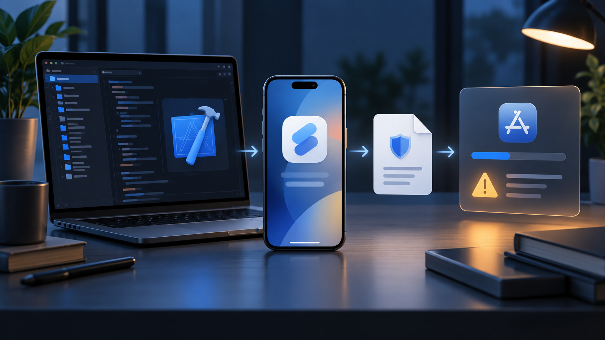

이 그림에서 볼 것은 Xcode 프로젝트, iPhone 빌드, 개인정보 매니페스트, App Store 검증이 한 번의 출시 과정으로 연결된다는 점이다.

Flutter 3.44 이상에서 iOS 플러그인을 Swift Package Manager(SwiftPM)로 관리한다면 파일 추가만으로는 부족하다. 플러그인 리소스가 SwiftPM 타깃에 포함됐는지, 최종 `.app` 번들에 실제로 들어갔는지를 확인해야 한다. Required Reason API를 쓰지 않는 앱이라면 빈 매니페스트를 억지로 만들지 않는다. 업로드 누락 경고가 있다면 `ios/Runner`에만 파일을 둔 구성을 의심한다.

## 왜 SwiftPM 전환 뒤에 문제가 보이나

Flutter 공식 문서 기준으로 3.44부터 SwiftPM이 기본 활성화되고 CocoaPods는 유지보수 모드로 남는다. 플러그인이 SwiftPM을 지원하지 않거나 리소스 경로를 옮기지 않으면 Debug는 되더라도 Archive에서 파일이 빠질 수 있다.

| 확인 대상 | CocoaPods 경로 | SwiftPM 경로 | 놓치면 생기는 현상 |
|---|---|---|---|
| 플러그인 매니페스트 | `ios/Resources/PrivacyInfo.xcprivacy` | `ios/<plugin>/Sources/<plugin>/PrivacyInfo.xcprivacy` | 플러그인 번들에서 파일 누락 |
| 리소스 선언 | `resource_bundles` | `resources: [.process(...)]` | 빌드는 되지만 Archive 산출물에 없음 |
| 앱 자체 매니페스트 | Runner 타깃의 Copy Bundle Resources | Runner 타깃의 Copy Bundle Resources | 앱이 직접 사용하는 API를 설명하지 못함 |

## 플러그인 SwiftPM 타깃에 선언하기

플러그인 개발자라면 매니페스트를 `Sources/<target>` 아래에 두고 `Package.swift`의 타깃 리소스로 선언한다. 이 선언이 있어야 SwiftPM이 파일을 해당 패키지 리소스로 취급한다.

```swift
targets: [
    .target(
        name: "plugin_name",
        dependencies: [
            .product(name: "FlutterFramework", package: "FlutterFramework")
        ],
        resources: [
            .process("PrivacyInfo.xcprivacy")
        ]
    )
]
```

CocoaPods도 지원한다면 같은 매니페스트를 podspec의 리소스 번들에 연결한다.

```ruby
s.resource_bundles = {
  'plugin_name_privacy' =>
    ['plugin_name/Sources/plugin_name/PrivacyInfo.xcprivacy']
}
```

앱이 직접 Required Reason API를 쓰면 Xcode에서 App Privacy File을 만들고 실제 코드에 맞는 승인 이유를 선택한다. 예시 값을 복사하지 말고, 서드파티 SDK 데이터는 SDK 매니페스트와 Xcode Privacy Report로 검토한다.

## Archive에서 누락 여부 확인하기

시뮬레이터 실행보다 `archive` 안의 최종 번들 검사가 직접적이다. `Runner.xcarchive`는 실제 경로로 바꾼다.

```bash
ARCHIVE="build/ios/archive/Runner.xcarchive"
APP="$ARCHIVE/Products/Applications/Runner.app"

find "$APP" -name 'PrivacyInfo.xcprivacy' -print
codesign -d --entitlements :- "$APP" 2>/dev/null
```

출력이 비어 있으면 앱 타깃과 플러그인 리소스 선언을 다시 확인한다. 리소스 번들 내부는 다음처럼 검사한다.

```bash
find "$APP" -type d -name '*.bundle' -print0 |
  xargs -0 -I{} find "{}" -name 'PrivacyInfo.xcprivacy' -print
```

CI에서는 `flutter build ipa --release` 이후 `find` 결과가 0개일 때 실패하도록 검사할 수 있다. 단, API나 데이터 수집이 없는 앱은 “파일이 반드시 있어야 한다”는 가정부터 재검토한다.

## 출시 전 체크리스트

- [ ] `flutter --version`과 SwiftPM 사용 여부를 빌드 로그에 남겼다.
- [ ] 플러그인의 `PrivacyInfo.xcprivacy` 위치가 `Sources/<target>` 아래다.
- [ ] `Package.swift`에 `.process("PrivacyInfo.xcprivacy")`가 있다.
- [ ] CocoaPods 경로를 지원한다면 `resource_bundles`도 같은 파일을 가리킨다.
- [ ] Archive의 `.app`와 내부 `.bundle`에서 실제 파일을 찾았다.
- [ ] API 이유와 App Privacy 응답을 코드·SDK 동작과 대조했다.

핵심은 매니페스트 작성보다 번들 귀속과 산출물 검증이다. 파일을 추가했는데도 오류가 남으면 plist 내용보다 `Package.swift`의 `resources`와 Archive 내부 경로를 확인한다.

공식 기준은 [Apple의 Privacy manifest 문서](https://developer.apple.com/documentation/bundleresources/privacy-manifest-files)와 [Required Reason API의 데이터 사용 안내](https://developer.apple.com/documentation/bundleresources/describing-data-use-in-privacy-manifests), Flutter의 [Swift Package Manager 플러그인 가이드](https://docs.flutter.dev/packages-and-plugins/swift-package-manager/for-plugin-authors)에서 확인할 수 있다.
