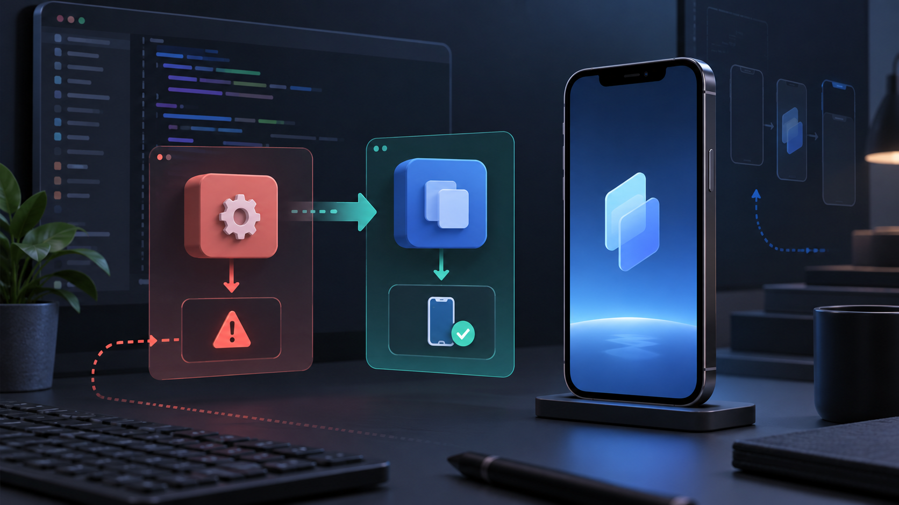

Flutter 앱을 Xcode 27로 빌드한 뒤 실행 직후 종료된다면, 커스텀 `AppDelegate`가 UIScene 수명 주기를 가로막는지 확인하는 게 우선이다. Flutter 3.41 이상에서 기본 `AppDelegate`만 쓰는 앱은 자동 마이그레이션 대상이지만, 푸시 알림·네이티브 SDK·플랫폼 채널 코드를 직접 넣었다면 수동 이전이 필요하다. `Info.plist`의 Scene 설정만 복사하는 것으로 해결되지 않는다.

## 증상과 적용 범위

Flutter 공식 문서 기준으로 Flutter 3.38에서 UIScene 지원이 들어갔고, 3.41부터 iOS 앱의 기본 지원이 활성화됐다. 최신 SDK로 빌드한 앱이 UIScene을 채택하지 않으면 시작 단계에서 실행되지 않을 수 있다. 특히 아래처럼 `AppDelegate`를 수정한 프로젝트가 위험하다.

| 프로젝트 상태 | 판단 | 조치 |
|---|---|---|
| Flutter가 만든 기본 `AppDelegate` | 자동 이전 가능 | `flutter build ios`로 마이그레이션 로그 확인 |
| `didFinishLaunchingWithOptions`에 플러그인 등록 | 수동 이전 필요 | `FlutterImplicitEngineDelegate`로 등록 위치 이동 |
| `FlutterViewController`를 직접 생성 | 별도 검토 | `awakeFromNib` 또는 Scene 연결 시점으로 이동 |
| Flutter 3.41 미만 | 자동 이전 기대 금지 | SDK 업그레이드와 수동 변경을 분리해 검증 |

앱이 단순히 흰 화면을 보이는 경우에도 같은 원인을 의심할 수 있다. 다만 인증 서버, 딥 링크, 특정 플러그인의 초기화 실패가 원인일 수도 있으므로 “iOS 27이면 무조건 UIScene 문제”라고 단정하면 안 된다.

## 커스텀 AppDelegate를 옮기는 핵심

기존에는 `application(_:didFinishLaunchingWithOptions:)`에서 `GeneratedPluginRegistrant.register(with:)`를 호출하는 구성이 흔했다. UIScene 전환 뒤에는 Flutter 엔진이 초기화되는 콜백으로 플러그인 등록을 옮긴다. 아래는 Swift 프로젝트의 최소 형태다.

기존 앱 delegate 등록은 유지하되, implicit Flutter engine을 쓰는 경로에도 같은 플러그인을 연결한다. 메서드 채널이나 플랫폼 뷰처럼 엔진에 의존하는 코드는 새 콜백으로 옮긴다.

```swift
import Flutter
import UIKit

@main
@objc class AppDelegate: FlutterAppDelegate, FlutterImplicitEngineDelegate {
  override func application(
    _ application: UIApplication,
    didFinishLaunchingWithOptions launchOptions: [UIApplication.LaunchOptionsKey: Any]?
  ) -> Bool {
    GeneratedPluginRegistrant.register(with: self)
    return super.application(
      application,
      didFinishLaunchingWithOptions: launchOptions
    )
  }

  func didInitializeImplicitFlutterEngine(
    _ engineBridge: FlutterImplicitEngineBridge
  ) {
    GeneratedPluginRegistrant.register(with: engineBridge.pluginRegistry)
  }
}
```

앱이 `FlutterViewController`를 스토리보드에서 직접 만든다면 `AppDelegate`에서 윈도우를 만드는 코드를 그대로 유지하지 않는다. Flutter 문서가 제시한 것처럼 컨트롤러 하위 클래스의 `awakeFromNib` 또는 `UISceneDelegate`의 `scene(_:willConnectTo:options:)`로 UI 초기화 책임을 옮긴다. 프로세스 초기화와 화면 연결을 한 메서드에 섞어 두면 자동 마이그레이션이 성공해도 런타임 동작이 달라질 수 있다.

## 빌드 전후 확인 순서

마이그레이션 여부를 눈으로만 판단하지 않고 CLI 출력과 산출물에서 확인한다.

```bash
flutter --version
flutter build ios --config-only --no-codesign
flutter build ipa --release --no-codesign
```

`flutter build ios` 로그에 `Finished migration to UIScene lifecycle`가 나오면 자동 이전이 수행된 것이다. 커스텀 `AppDelegate`를 쓰는 앱에서 경고가 남으면 `ios/Runner/AppDelegate.swift`, `ios/Runner/Info.plist`, 커스텀 Scene delegate 유무를 함께 비교한다. 출시용으로는 실제 기기에서 앱 시작, 백그라운드 복귀, 푸시 탭, 딥 링크 진입을 각각 확인해야 한다. 시뮬레이터에서 화면이 열린 것만으로는 수명 주기 이전이 끝났다고 보기 어렵다.

체크리스트는 다음처럼 짧게 남기면 된다.

- [ ] `flutter --version`이 UIScene 자동 지원 범위인지 기록했다.
- [ ] 커스텀 `AppDelegate`의 플러그인 등록을 엔진 초기화 콜백으로 옮겼다.
- [ ] `AppDelegate`에 남은 UI 윈도우 생성 코드를 점검했다.
- [ ] Release IPA를 실제 iPhone에서 실행했다.
- [ ] 푸시·딥 링크·백그라운드 복귀를 각각 확인했다.
- [ ] Xcode 27 SDK로 빌드한 테스트 결과와 Flutter 버전을 함께 보관했다.

## 요점 정리

이번 오류는 Dart 위젯 코드보다 iOS 앱 진입점의 수명 주기 불일치에서 발생할 가능성이 크다. 기본 프로젝트는 자동 이전을 활용할 수 있지만, `AppDelegate`를 건드린 앱은 플러그인 등록과 UI 연결을 분리해야 한다. 임시로 Scene manifest를 숨기는 방법은 원인 확인용일 뿐 출시 해결책으로 남기지 않는 편이 안전하다.

Flutter의 [UIScene 마이그레이션 가이드](https://docs.flutter.dev/release/breaking-changes/uiscenedelegate)는 Flutter 3.41의 자동 이전 조건과 수동 `AppDelegate` 변경을 설명한다. Apple의 [UIKit scene-based life cycle 기술 문서](https://developer.apple.com/documentation/technotes/tn3187)는 최신 SDK에서 UIScene이 필요한 배경을 안내한다. 두 문서의 확인 기준은 2026년 9월 20일이다.
